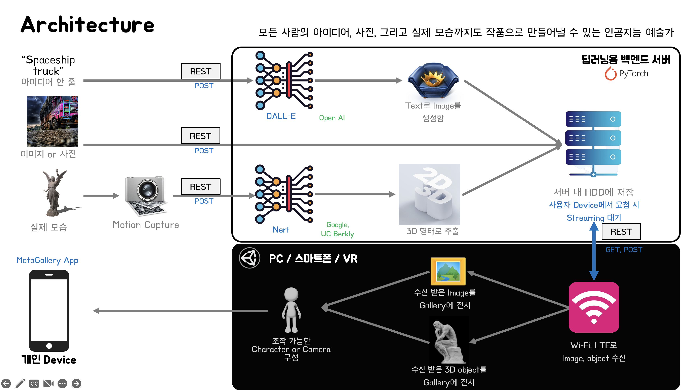
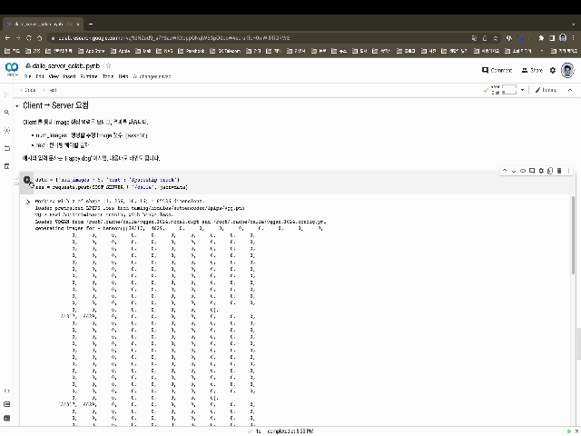
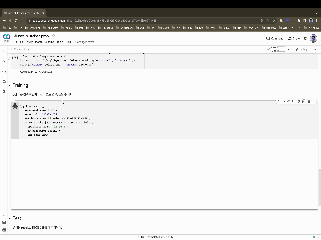
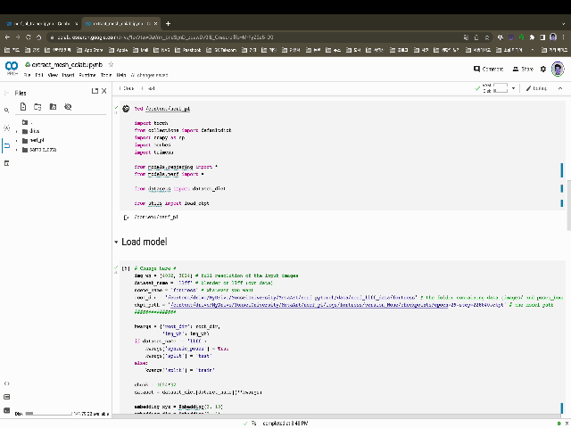

# MetaArtServer

이 프로젝트는 [연세대학교 공학대학원](https://eyonsei.yonsei.ac.kr/main.asp) 인공지능전공 2022년 팀 프로젝트로 수행한 과제입니다.

저희는 디지털 아트와 메타버스에 관심이 많은 사람들이 모여 만들어진 메타아트 팀입니다.저희는 이미지 뿐만이 아니라, 텍스트, 실제 물체도 가상 공간에 전시해보자는 목적으로 메타버스 공간상에 갤러리를 만들었습니다.

### **개요**

메타버스는 현실보다 접근하기 쉬우며, 온라인에서보다 더 인상깊은 작품 감상이 가능합니다.  
메타버스 갤러리는 `누구나 쉽게 미술에 접근할 수 있는 가상현실 수단`에서 `작가의 아이디어부터 실제 물체까지도 Art로 만들어보는 도구` 를 구현한 겁니다.

### **Architecture**

모든 사람의 아이디어, 사진, 그리고 실제 모습까지도 작품으로 만들어내기 위해 저희는 다음과 같은 3개의 Project 를 통합해서 구현했습니다.이를 위해 DALL-E, Nerf 등의 Deep-Learning Network와 RESTful API, 그리고 Unity 등 다양한 개발 Tool 을 사용했습니다.

- [MetaArtGallery](https://github.com/maroomir/MetaArtGallery)
- [MetaArtServer](https://github.com/maroomir/MetaArtServer)
- [MetaArtClient](https://github.com/maroomir/MetaArtClient)

---

## DALLE

DALL-E 는 OpenAI 에서 만든 Text to Image generator 네트워크 입니다.  
다만 Model 자체가 공개가 안되있기 때문에 [커뮤니티 버전](https://github.com/lucidrains/DALLE-pytorch)을 사용했습니다.

구동 방법은 아래와 같습니다.

- Discreate VAE 로 입력 Image 를 32 X 32 크기의 Image token 으로 압축함
- Image token 과 Encoding 된 Text token 을 접합해서 Transformer 에 입력하고, Image 에서 추출할 수 있는 모든 Text token 들을 분류함
- Image 와 Text 간의 결합 확률 분포를 예측하기 위해 CLIP 을 사용함.

---

## Nerf

Nerf 는 2D Images 또는 영상을 3D Object 로 바꿀 수 있는 3D 모델링 네트워크입니다.  
torch 를 사용한 [다음 버전](https://github.com/kwea123/nerf_pl)을 사용했습니다.

- 3D Point의 Sample-Set 에 바라보는 방향을 지정해서 2D Viewing direction 을 생성함.
- 5차원 Data 를 구성해서 MLP 를 통과시킴
- 네트워크에 통과된 객체에 대한 density와 color 를 획득함.
- 획득한 color와 density를 2D Image 상에 축척함
- 위 과정을 획득한 Image 수만큼 반복함

---

## 사양

프로토콜 사양에 관련된 내용은 [spec 문서](spec.md)를 참고 바랍니다.